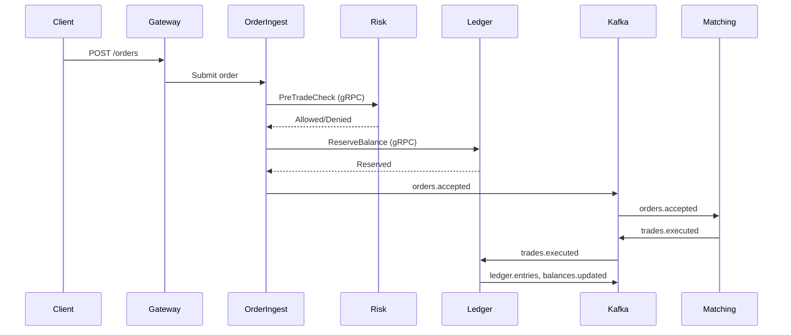

# goex

Event-driven trading platform with gRPC services, Kafka event flow, and PostgreSQL persistence.

## Architecture


## Local Development
1. `make dev-start`
2. `make dev-verify`
3. `make dev-test`

## Tests
Run all tests:
```bash
./scripts/test-full.sh
```
