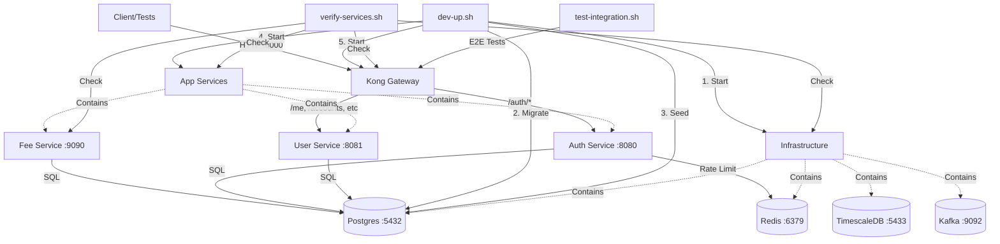

# Local Development Stack

This project ships a docker-compose stack for local development that includes infrastructure, application services, and the Kong gateway.

## Quick Start
```bash
make dev-start
make dev-verify
make dev-test
```

## Service Architecture


## Start
```bash
./scripts/dev-up.sh
```

## Stop
```bash
./scripts/dev-down.sh
```

## Full reset (remove volumes)
```bash
docker compose -f deploy/docker-compose.yml down -v
```

## Services and Ports
- Postgres: `localhost:5432`
- TimescaleDB: `localhost:5433`
- Redis: `localhost:6379`
- Kafka: `localhost:9092`
- Auth service: `localhost:8080` (`/healthz`)
- User service: `localhost:8081` (`/healthz`)
- Fee service gRPC: `localhost:9090`
- Fee service HTTP: `localhost:8082` (`/healthz`, `/metrics`)
- Kong proxy: `localhost:8000`
- Kong admin: `localhost:8001` (`/status`)

## Default Credentials
Postgres:
- user: `cex`
- password: `cex`
- database: `cex_core`

TimescaleDB:
- user: `cex_ts`
- password: `cex_ts`
- database: `cex_timeseries`

## Seed Data

The dev stack automatically seeds demo data after migrations when `CEX_ENV=dev` or `CEX_ENV=test`.
To seed manually:

```bash
CEX_ENV=dev ./scripts/seed.sh
```

**WARNING: This is dev/test-only data. Never use in production.**

### Demo Users

- **demo@example.com** / `demo123`
- **trader@example.com** / `trader123`

Both users have:
- Status: `active`
- KYC Level: `verified`
- MFA: disabled
- Spot accounts with sample balances
- API keys with `trade` and `read` scopes

Seeds are deterministic and idempotent.

### Test Fixtures (Optional)
Set `SEED_TESTDATA=1` to add extra test users (MFA/suspended):
```bash
CEX_ENV=dev SEED_TESTDATA=1 ./scripts/seed.sh
```

## Testing
Run gateway integration tests against the local stack:
```bash
make dev-test
```

## Service Logs
```bash
make dev-logs
```

## Troubleshooting
- Port conflicts: ensure 5432, 5433, 6379, 9092, 8000, 8001, 8080, 8081 are free.
- JWT secret not set: set `CEX_JWT_SECRET` in `deploy/.env`.
- Services not healthy: run `make dev-verify` or `./scripts/health-check.sh`.

## Environment Variables
| Variable | Description | Default |
| --- | --- | --- |
| `CEX_JWT_SECRET` | JWT signing secret for auth/user services | `dev-secret-change-in-production-min-32-chars` |
| `CEX_ENV` | Environment name | `dev` |
| `CEX_RATE_LIMIT_REDIS_ADDR` | Redis address for auth rate limit | `redis:6379` |
| `CEX_GRPC_PORT` | Fee gRPC port | `9090` |
| `CEX_HTTP_PORT` | Fee HTTP port | `8080` |
| `CEX_CACHE_REFRESH_INTERVAL` | Fee tier cache refresh interval | `5m` |
| `GATEWAY_URL` | Kong proxy URL for tests | `http://localhost:8000` |
| `POSTGRES_USER` | Postgres user | `cex` |
| `POSTGRES_PASSWORD` | Postgres password | `cex` |
| `POSTGRES_DB` | Postgres database | `cex_core` |
| `TIMESCALE_USER` | TimescaleDB user | `cex_ts` |
| `TIMESCALE_PASSWORD` | TimescaleDB password | `cex_ts` |
| `TIMESCALE_DB` | TimescaleDB database | `cex_timeseries` |
| `KAFKA_ADVERTISED_LISTENERS` | Kafka advertised listeners | `PLAINTEXT://localhost:9092` |

## Kafka
- Bootstrap servers: `localhost:9092`
- Advertised listeners default to `PLAINTEXT://localhost:9092`
- Image: `apache/kafka:3.7.0` (chosen for local KRaft compatibility)

## Notes
- Update `deploy/.env.example` and provide a `deploy/.env` if you want custom credentials.
- TimescaleDB is exposed on port `5433` to avoid clashing with Postgres.
